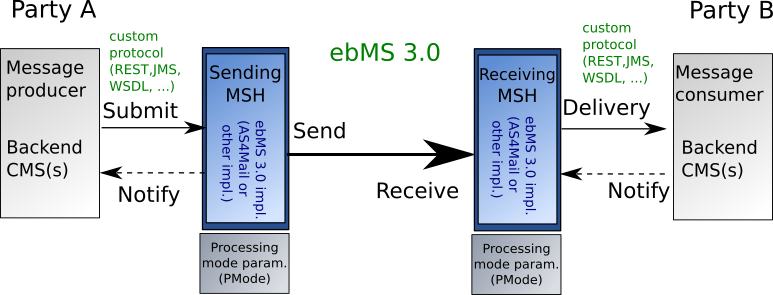

## Purpose

WarpSource/AS4Mail is a multipurpose ebMS 3.0 software solution. Its code is forked from VsrsCif/Laurentius, the eDelivery AS4 conformant Access Point implementation maintained by the IT department of the Supreme Court of the Republic of Slovenia (VSRS).
The VsrsCif/Laurentius is a production-ready solution and is developed/ upgraded according to owners needs and requests.  
This fork is maintained by original authors/developers of VsrsCif/Laurentius with purpose to independently develop new features, to provide up-to dates security upgrades, and also to explore new possibilities of using ebMS 3.0 standards for B2B integrations. 

## Why to use ebMS 3.0 standard for B2B

Business interactions are dynamic. Not only from the service content viewpoint, but also from the business partner aspect where partner changes its interaction capabilities as: changing URL, certificates, technologies, HTTPS ciphers, etc..  Also adding new (and removing) partners on existing services is producing workload and costs on tasks as negotiation, configuring and testing.

Even though that B2B interactions are various,  most of them share common messaging aspects as: security, reliability, addressing,  message non-repudiation validation ... These B2B message transfer aspects usually do not have business values which are processed in backend systems. 

The backend business data are usually in the message payload(s). 
The ebMS 3.0 standard is payload agnostics and focuses on message transfer aspects. In other words it leaves the backend system to focus on business data, but leaves message transfer aspects as: security, reliability, non-repudiation, transfer protocols, to so-called MSH (message service handler) component.

When having multiple backend systems and many clients this approach is cost saving on tasks as maintenance of clients interaction capabilities like URL endpoints, certificates, and also when applying the latest security recommendation in electronics transfer protocols.

Another strong reason for using the ebMS 3.0 standard is its potential widespread use of the standards. Nowadays many other equally efficient standards and solutions handle message transfer aspects. For a quick and costless start of B2B communication also the partner software must "speak" the same technical language. Else we or the partners must implement new standards or buy new software solutions. The ebMS 3.0 standard was proposed by the European Commission and also used by many of its projects for reaching the goal of common B2B marked.
At the project eDelivery (https://ec.europa.eu/cefdigital/wiki/display/CEFDIGITAL/eDelivery) developed example of ebMS 3.0 (AS4 eDelivery profile) called Domibus and also providing conformance tests and also a list of software compliant with that profile for message exchange.

## Arhitecture

The ebMS 3.0 (ebXML Messaging Service) standard is part of the OASIS ebXML (Electronic Business using eXtensible Markup Language) standard family for providing modern, XML-based,  open infrastructures to promote global e-commerce in an interoperable, secure and consistent manner. 
The ebMS 3.0 defines a component MSH (Messaging Service Handler). The purpose of MSH is when sending mail to format and update messages with transfer specific data, and when receiving mail to verify and accept incoming messages. 

 

 
The ebMS 3.0 standard also defines a set of parameters for the determination of the security level, the reliability mechanisms, addressing types, message payload type, underlying transport and bussines context. When two implementations of the MSH synchronize P-MODE parameters they should be able to exchange messages, regardless of MSH vendors, program language, or operation system users are using. 

